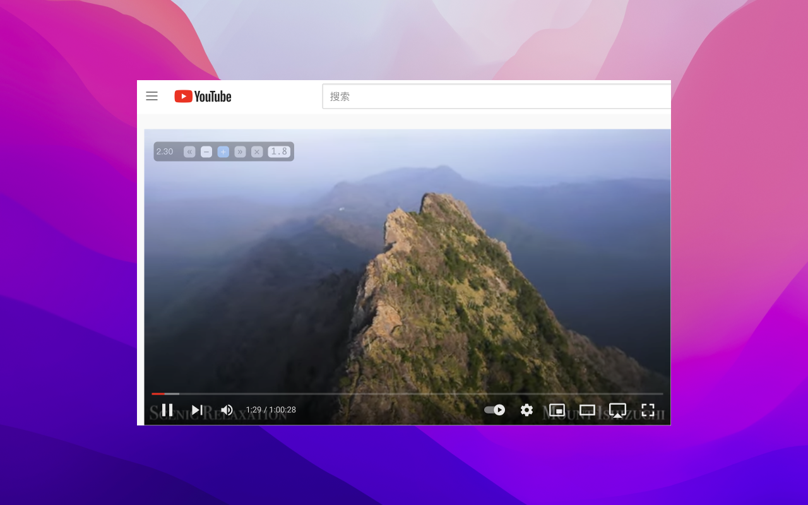

# Video Speed Controller

A Safari port version of an MIT open source Chrome extension(https://github.com/igrigorik/videospeed) for controlling the video speed of any video in a website.

---

## Download

Video Speed Controller is available on App Store and Mac App Store now, you can get it using the link below. You can also build it by yourself, please refer to `Build` section.

 

## Build

open `Video Speed Controller/Video Speed Controller.xcodeproj` and hit `⌘ R` !

## LICENSE

You are permitted to use this
source code, with or without modification, in source or binary form, on
your devices however you see fit. You are not permitted to redistribute
binaries of this source code, with or without modification. In other
words, you cannot put this application or any application derived from
it, on the Apple App Store, Cydia, or any other binary-only distribution
channel.

你可以任意修改、使用该源代码，也可以用于商业目的。但不能将此应用或者修改的应用的二进制文件上传到 App Store 或者通过其它分发渠道（包括但不限于网站、网盘、聊天软件）分享二进制文件。
